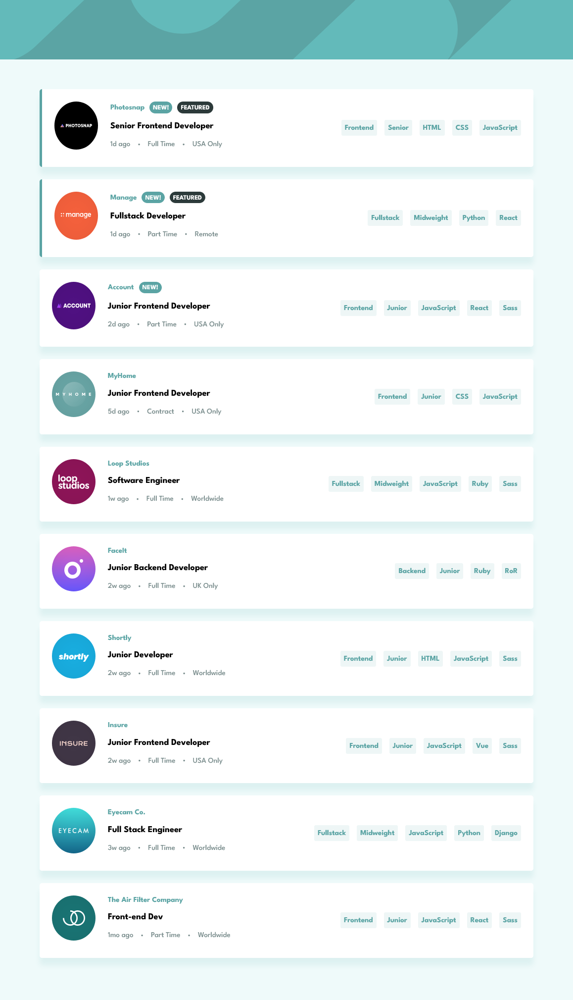

# Frontend Mentor - Job listings with filtering solution

This is a solution to the [Job listings with filtering challenge on Frontend Mentor](https://www.frontendmentor.io/challenges/job-listings-with-filtering-ivstIPCt). Frontend Mentor challenges help you improve your coding skills by building realistic projects.

## Table of contents

- [Overview](#overview)
  - [The challenge](#the-challenge)
  - [Screenshot](#screenshot)
  - [Links](#links)
- [My process](#my-process)
  - [Built with](#built-with)
  - [What I learned](#what-i-learned)
  - [Continued development](#continued-development)
  - [Useful resources](#useful-resources)
- [Author](#author)

## Overview

### The challenge

Users should be able to:

- View the optimal layout for the site depending on their device's screen size
- See hover states for all interactive elements on the page
- Filter job listings based on the categories

### Screenshot



### Links

- Solution URL: [https://github.com/jeansy42/static-jobs-listings-master](https://github.com/jeansy42/static-jobs-listings-master)
- Live Site URL: [https://jeansy42.github.io/static-jobs-listings-master/](https://jeansy42.github.io/static-jobs-listings-master/)

## My process

### Built with

- Semantic HTML5 markup
- CSS custom properties
- Flexbox
- [React](https://reactjs.org/) - JS library
- [Sass](https://sass-lang.com/) - CSS preprocessor

### What I learned

With the development of this project, I have put into practice the skills acquired in HTML, CSS, and Javascript. Each new challenge forces us to learn new abilities and expand our thinking as programmers, leading us to propose solutions that we once believed were impossible to achieve. I am proud of the work, and the following function represents that:

```js
const getFilteredJobs = async () => {
  const jobs = await getJobs();
  const filteredJobs = jobs.filter((job) => {
    return (
      (filters.role === "" || job.role === filters.role) &&
      (filters.level === "" || job.level === filters.level) &&
      (filters.languages.length === 0 ||
        filters.languages.every((lang) => job.languages.includes(lang))) &&
      (filters.tools.length === 0 ||
        filters.tools.every((tool) => job.tools.includes(tool)))
    );
  });
  return filteredJobs;
};
```

### Continued development

I intend to continue developing my skills in JavaScript and React through the creation of more complex projects, making my knowledge increasingly useful, and ultimately securing my first job as a programmer.The next step will be to learn a state management tool such as Redux Toolkit.

### Useful resources

- [ChatGPT](https://chat.openai.com/) - My right hand, always clarifying doubts and making development more viable.

## Author

- Frontend Mentor - [@jeansy42](https://www.frontendmentor.io/profile/jeansy42)
- Twitter - [@jeansy42](https://www.twitter.com/jeansy42)
